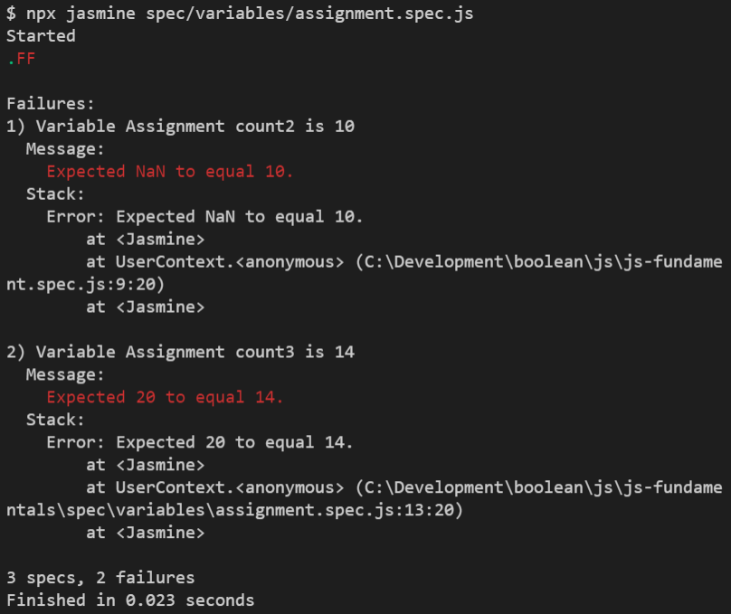

# JS Fundamentals

### Setup

1. Fork this repository to your GitHub account
2. Clone your forked repository to your machine
3. Change directory into the project.
4. Install the project dependencies

```sh
$ npm install
```

### Exercises
- [Variables](./src/variables/README.md)
  - [Declaration](./src/variables/declaration.js)
  - [Assignment](./src/variables/assignment.js)
- [Data Types](./src/data-types/README.md)
  - [Examples](./src/data-types/example.js)
  - [Numbers](./src/data-types/numbers.js)
  - [Strings](./src/data-types/strings.js)
  - [Arrays](./spec/data-types/arrays/README.md)
    - [Examples](./src/data-types/arrays/example.js)
    - [Accessing Element](./src/data-types/arrays/accessing-elements.js)
    - [Adding and Removing Elements](./src/data-types/arrays/adding-removing-elements.js)
  - [Objects](./spec/data-types/objects/README.md)
    - [Examples](./src/data-types/objects/example.js)
    - [Object Keys](./src/data-types/objects/object-key.js)
    - [Creating Objects](./src/data-types/objects/creating-objects.js)
    - [Objects And Arrays](./src/data-types/objects/objects-and-arrays.js)
- [Loops](./src/loops/README.md)
  - [Examples](./src/loops/example.js)
  - [For Loop Basics](./src/loops/for-loop-basics.js)
  - [For Loops And Arrays](./src/loops/for-loops-and-arrays.js)
- [Functions](./src/functions/README.md)
  - [Examples](./src/functions/example.js)
  - [Calling Functions](./src/functions/calling-functions.js)
  - [Creating Functions]('./src/functions/creating-functions.js')
  - [Creating Functions with Multiple Arguments](./src/functions/creating-functions-multiple-args.js)
- [Conditional Flow](./src/conditional-flow/README.md)
  - [Examples](./src/conditional-flow/example.js)
  - [Boolean Conditions](./src/conditional-flow/boolean-conditions.js)
  - [Numeric Conditions](./src/conditional-flow/numeric-conditions.js)
  - [String Conditions](./src/conditional-flow/string-conditions.js)
  - [Multiple Conditions](./src/conditional-flow/multiple-conditions.js)

### Instructions

Once you've gone through set up, start with the first exercise in the list above. Your job is to write code for each exercise to make the tests pass, one test at a time.

To start, always first run the tests for the set of exercises you are on. The simplest way to do this is to open up the project in VS Code, start a new terminal (`Terminal` -> `New` from the menu)  then run the `npx jasmine` command. For example, for the first tests, `variables/assignment.spec.js` you would run:

```sh
$ npx jasmine spec/variables/assignment.spec.js
```


**Inspect** this output. Your output might be slightly different. Read through this, and focus on one test at a time. Get the tests to pass by editing the corresponding source file for the test, located in the `src` directory. In the above example, you would edit `src/variables/assignment.js` and follow the instructions to make the test pass.

**NB:** Do not change any code in the `spec` directory. When you encounter something you don't know, research it, using the [MDN Web Docs](https://developer.mozilla.org/en-US/docs/Web/JavaScript/Reference). 

The README file for each topic also contains an overview of the concepts required to make the tests pass. In the README files, when you see this message:

> 👨‍💻 Run these examples in your REPL as you read along! 👨‍💻

Open up your REPL and type in the code samples as you go. Once you've passed the tests for each exercise, push your work to your repository
```sh
$ git add src/variables/assignment.js
$ git commit -m "variable assignments completed"
```

> **Important** - running git commit runs a test to check the formatting of your code. **If there are errors the command will abort.**
> Make sure you see no errors in the exercise you completed before continuing. If you see errors, read them carefully and **fix your work** before repeating the above steps.
> You can verify a successful commit by checking with `git log` - verify you see the commit message.
```
$ git push origin main
```
Then, move on to the next exercise!


### Tests
You can run all the tests manually whenever you want:
```sh
$ npm test
```

This will run two sets of tests.

### Linter Tests
Using `npm test` will first run a set of tests that make sure your code satisfies specific stylistic rules - make sure you resolve these problems as you go.

You can also run the linter manually whenever you want and autocorrect where it's possible:
```sh
npx eslint src --fix
```

### Functional Tests
The second set of tests that will run are functional. They test the behaviour of the programs you write.

You can also run the tests manually whenever you want
```sh
npx jasmine # run all the tests
# or
npx jasmine spec/variables/assignment.spec.js # run a set of tests in a spec file
```
